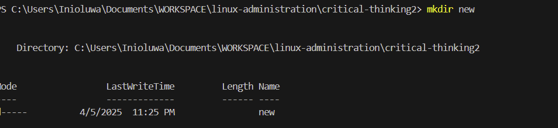
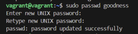
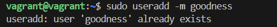
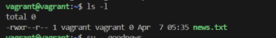

## Task 1: Choosing the Best OS for DevOps Automation

### Comparison between Linux and Windows for DevOps Tasks

In the world of DevOps, choosing the right operating system (OS) for automation tasks is crucial for efficiency and scalability. Linux and Windows are two major operating systems that are commonly used for DevOps tasks, each with its strengths and weaknesses. This comparison will focus on three core areas: scripting, package management, and containerization.

#### 1. **Scripting:**
   - **Linux:**
     Linux is widely preferred for scripting tasks, primarily due to its robust command-line interface (CLI). Shell scripting using Bash is native to Linux and is integral to automating a variety of DevOps tasks such as deployment, configuration management, and system monitoring. Linux also supports powerful scripting languages like Python, Perl, and Ruby, which are commonly used in automation.
     - **Advantages:** Scripting on Linux is generally more efficient, and it has a rich set of tools for text manipulation, file system navigation, and system resource management.
     - **Limitations:** The learning curve can be steeper for newcomers to Linux, but for experienced users, it’s the de facto OS for automation.

   - **Windows:**
     Windows provides PowerShell as its native scripting tool, which is a versatile and powerful language for automating tasks. PowerShell can perform many tasks similar to Linux shells, but it has a unique syntax and command structure. While PowerShell is robust, it has a steeper learning curve, especially for those familiar with Bash scripting.
     - **Advantages:** PowerShell can integrate seamlessly with Windows-specific features and applications, providing deep system control.
     - **Limitations:** It is less versatile than Linux shells for cross-platform scripting and tends to be more Windows-centric.

#### 2. **Package Management:**
   - **Linux:**
     Linux systems are equipped with package managers like APT (Debian/Ubuntu), YUM (CentOS/RedHat), and Pacman (Arch Linux), which make it easy to install, update, and manage software packages. These tools are optimized for automation and provide fast and reliable ways to install and maintain software dependencies.
     - **Advantages:** Package management on Linux is streamlined and standardized, making it easier to maintain software packages across environments. Many DevOps tools (e.g., Docker, Kubernetes, Ansible) are designed to work seamlessly on Linux.
     - **Limitations:** Some enterprise tools and proprietary software are not readily available on Linux, though many alternatives exist.

   - **Windows:**
     Windows offers a package manager called **Windows Package Manager (winget)**, which has been growing in popularity but is not as mature as Linux’s package managers. Additionally, **Chocolatey** and **Scoop** are third-party package managers often used on Windows for managing software installations.
     - **Advantages:** Windows package managers have been improving, with winget providing easier ways to manage software from the command line. PowerShell’s scriptability also allows for advanced automation in managing packages.
     - **Limitations:** Windows package managers are not as fully integrated or widely adopted in enterprise environments as those on Linux.

#### 3. **Containerization:**
   - **Linux:**
     Linux is the natural home for containerization, largely due to Docker, Kubernetes, and other container tools. Containers on Linux have long been the standard, and these technologies rely on Linux-specific kernel features, such as cgroups and namespaces. As a result, Linux provides the best compatibility and performance for containerized environments.
     - **Advantages:** Docker and Kubernetes have native support for Linux, and containers are lightweight and efficient on Linux systems.
     - **Limitations:** While Linux excels in containerization, managing containers on Linux can be more complex in certain setups, especially for non-Linux experts.

   - **Windows:**
     While Windows now supports Docker containers (primarily Windows containers), Linux-based containers still perform better and are the more common choice in most DevOps environments. Windows containers are more tightly integrated with Windows Server and are typically used in very specific use cases, like legacy applications.
     - **Advantages:** Windows containers are helpful for running applications that are designed specifically for the Windows ecosystem.
     - **Limitations:** The limitations of Windows containers include reduced portability compared to Linux containers and a more complex setup.

### Conclusion: Which OS is More Suitable for Automation in a DevOps Environment?

**Recommendation: Linux**

In a DevOps environment, **Linux** is the more suitable choice for automation tasks. The reasons for this are clear:
- **Scripting:** Linux offers an established, powerful, and efficient scripting environment with Bash and other languages. Its native command-line tools make automation quicker and more flexible.
- **Package Management:** Linux's advanced and reliable package management systems ensure seamless software updates and environment consistency, which is vital in DevOps automation.
- **Containerization:** Linux's native support for Docker and Kubernetes makes it the best choice for managing containerized applications. As most production systems are built around Linux containers, it ensures compatibility and performance.

While **Windows** has made strides in automation, particularly with PowerShell and Windows containers, Linux’s long-standing dominance in server environments and cloud platforms makes it the clear winner for most DevOps automation tasks. Its open-source nature, extensive documentation, and active community support only add to its appeal in modern DevOps workflows.


## Task 2: Introduction to the Command Line

### Executing this: Deliverable:

- Command-Line Guide: Use a Linux distribution (e.g., Ubuntu) to execute and document the following commands:

ls: List files and directories


cd: Navigate directories


mkdir: Create directories


cat: View file contents


rm: Delete files


### Command-Line Guide for Linux: Practical Use in DevOps

This guide will document the essential Linux commands: `ls`, `cd`, `mkdir`, `cat`, and `rm`. For each command, we will explain what it does, why it is useful, and provide a DevOps-related example of how it can be applied in automation and environment management.

---

#### 1. **`ls` - List Files and Directories**

- **What It Does:**
  The `ls` command lists files and directories in the current directory. It’s one of the most frequently used commands in the terminal and helps you quickly inspect the contents of a folder.

- **Why It’s Useful:**
  `ls` is useful for checking the structure of directories and verifying the presence of specific files and directories. It helps to navigate a system and inspect configuration files, logs, or code repositories.

- **Example in DevOps Context:**
  Suppose you are automating the deployment of a web application and need to verify that the necessary configuration files (e.g., `nginx.conf`, `Dockerfile`) exist in the deployment directory before starting the service.

  **Command:**
  ```bash
  ls /var/www/html/
  ```

  **Expected Output:**
  ```bash
  index.html  nginx.conf  Dockerfile  assets/
  ```

  **Application:**
  Before running the deployment script, use `ls` to check that all required files are in place.

---

#### 2. **`cd` - Change Directory**

- **What It Does:**
  The `cd` (change directory) command allows you to navigate between different directories on the filesystem. It is used to move to a specific directory where files or scripts are located.

- **Why It’s Useful:**
  As you work with servers and automation, you will frequently need to switch between directories to inspect logs, configuration files, and manage the environments. Understanding how to navigate through the filesystem is crucial in any automation workflow.

- **Example in DevOps Context:**
  If you're working with a Git repository and need to navigate to the directory where the repository has been cloned, you would use the `cd` command.

  **Command:**
  ```bash
  cd /home/user/myapp/
  ```

  **Application:**
  Navigating to the directory where your application resides so you can run `git pull`, `docker build`, or any deployment script.

---

#### 3. **`mkdir` - Make Directory**

- **What It Does:**
  The `mkdir` command creates a new directory in the current directory or at a specified path. You can create single or nested directories.

- **Why It’s Useful:**
  Creating directories is essential in any automation process. For example, setting up directories for logs, configuration files, or temporary files is common when automating tasks like deployments, backups, or testing environments.

- **Example in DevOps Context:**
  When automating the setup of an environment or application, you might want to create a specific directory to store log files or temporary data that needs to be generated during the deployment process.

  **Command:**
  ```bash
  mkdir -p /home/user/logs/deployment_logs
  ```

  **Application:**
  This command creates the `deployment_logs` directory inside the `/home/user/logs/` path, ensuring that logs from deployment scripts can be stored systematically.

---

#### 4. **`cat` - View File Contents**

- **What It Does:**
  The `cat` (concatenate) command displays the contents of a file on the terminal. It can also be used to create files or concatenate multiple files into one, but its most common use is to simply view the contents of a file.

- **Why It’s Useful:**
  `cat` is useful for checking configuration files, log files, or any text files to troubleshoot issues or ensure that the content is correct. In DevOps, you may need to quickly review log files or configuration settings during automation tasks to confirm the system is working as expected.

- **Example in DevOps Context:**
  After running an application or deployment script, you may want to check the content of a log file to verify that everything ran correctly or to troubleshoot errors.

  **Command:**
  ```bash
  cat /var/log/nginx/error.log
  ```

  **Application:**
  Checking the Nginx error log after deploying a web application to diagnose any issues or misconfigurations related to the web server.

---

#### 5. **`rm` - Remove Files**

- **What It Does:**
  The `rm` command is used to remove (delete) files or directories. It’s a powerful command because, by default, it deletes files without asking for confirmation.

- **Why It’s Useful:**
  In DevOps, you often need to clean up old files, temporary files, or unused configurations. For example, during an automated deployment process, outdated versions of the application might need to be removed.

- **Example in DevOps Context:**
  After a successful deployment, you might want to remove old temporary files or backups from the server to free up space and keep the environment clean.

  **Command:**
  ```bash
  rm -rf /home/user/old_backups/
  ```

  **Application:**
  This command removes the `old_backups` directory and all its contents recursively, ensuring that outdated backup files are deleted after the latest backup has been confirmed.

---

<!-- ### Conclusion

These basic Linux commands—`ls`, `cd`, `mkdir`, `cat`, and `rm`—are essential tools in a DevOps engineer’s toolkit. They allow you to navigate filesystems, inspect and manage files, and automate common system administration tasks. Mastering these commands is a prerequisite for moving on to more advanced DevOps tools like configuration management systems (e.g., Ansible, Chef), containerization (e.g., Docker), and orchestration (e.g., Kubernetes). By integrating these commands into your automation scripts, you can ensure smoother deployment processes, error management, and system maintenance. -->


## Task 3: Understanding OS Users and Permissions

### User Management and Permissions Documentation

- Create a new user on a Linux system.






- Modify file permissions using chmod to control access for specific users.


-  Verify file ownership and permissions with ls -l.




### Explain how managing users and permissions can improve security, particularly in a DevOps environment.


Managing **users** and **permissions** effectively is crucial for enhancing security, especially in a **DevOps environment** where collaboration, automation, and access control are key. Properly managing who can access what, and under what conditions, ensures that only authorized individuals and processes have the right access, minimizing the risk of unauthorized actions, data breaches, or accidental misuse.

Here’s how user and permission management can improve security in a DevOps environment:

### 1. **Least Privilege Principle**
- **What It Means**: Users should only have the minimum permissions necessary to perform their jobs or tasks. This reduces the risk of accidental or malicious misuse of elevated privileges.
- **In DevOps**: 
  - Developers may need access to code repositories, but they shouldn't have full administrative access to production environments.
  - Permissions for accessing servers, databases, and other infrastructure should be granular and specific to roles (e.g., deployer, admin, tester).
  - By enforcing the least privilege, you prevent users from accidentally altering critical systems or accessing sensitive data they don't need.

### 2. **Role-Based Access Control (RBAC)**
- **What It Means**: RBAC allows organizations to define roles (e.g., developer, system administrator, or project manager) and assign permissions based on roles instead of individuals. Users are given access according to the needs of their role.
- **In DevOps**: 
  - Teams can be segmented based on their responsibilities, such as developers working on code, operators deploying applications, and security engineers monitoring infrastructure.
  - A **DevOps pipeline** can be set up so that only certain roles can deploy to production, while others can only test or build the software.
  - By carefully managing roles, you avoid "over-permissioning," where users might have access to resources they don’t need to perform their tasks.

### 3. **Auditing and Monitoring Access**
- **What It Means**: By tracking and logging user activity, you can monitor who accessed what, when, and what actions they performed. This is critical for identifying potential security breaches or suspicious activity.
- **In DevOps**:
  - Tools like **audit logs** and **SIEM (Security Information and Event Management)** systems can log all activities related to infrastructure, repositories, and deployments.
  - In case of a breach, you can trace unauthorized access and identify the origin of the problem.
  - Monitoring also helps detect misconfigurations, like developers mistakenly getting access to production systems.

### 4. **Separation of Duties**
- **What It Means**: This concept ensures that critical tasks or permissions are split between multiple people or roles so that no single user has unchecked control over sensitive operations.
- **In DevOps**:
  - For example, the same person who writes code should not be the person who deploys that code directly to production. By separating these duties, you ensure there is oversight and control at each stage of the development process.
  - This is often implemented in CI/CD pipelines, where different steps (build, test, deploy) are managed by different roles, ensuring a form of accountability.

### 5. **Automated User and Permission Management**
- **What It Means**: In DevOps, where automation is key, automating user creation, access assignment, and permissions management can improve security by reducing human errors and ensuring that permissions are consistently applied.
- **In DevOps**:
  - Infrastructure-as-Code (IaC) tools (e.g., **Terraform**, **Ansible**, **Chef**) can help automate user and group management across servers and cloud environments. This ensures that when a user is added or removed, their access rights are automatically updated without human intervention.
  - Temporary user permissions can be created for specific tasks (e.g., a user may be granted temporary admin rights for troubleshooting), reducing the likelihood of long-term misuse of elevated permissions.

### 6. **Password Management and Authentication**
- **What It Means**: Effective password management, such as using **multi-factor authentication (MFA)** and **strong password policies**, helps prevent unauthorized users from gaining access through weak or compromised credentials.
- **In DevOps**:
  - Use **single sign-on (SSO)** systems and MFA for DevOps tools to ensure that users authenticate in a secure manner.
  - Integrating with **identity management systems** (e.g., LDAP, Active Directory) helps streamline access control while enforcing strong password policies.
  - Automated systems should avoid hard-coding passwords and instead rely on secure vaults (e.g., **HashiCorp Vault**, **AWS Secrets Manager**) to store sensitive credentials like API keys, tokens, and passwords.

### 7. **Access to Sensitive Data and Resources**
- **What It Means**: Restricting access to sensitive data (e.g., customer data, private keys, production configurations) reduces the risk of data breaches or accidental exposure.
- **In DevOps**:
  - **Sensitive data** (like API keys, tokens, and private credentials) should be stored in encrypted vaults and never hardcoded into code or configuration files.
  - **Environment-specific access** should be configured so that users working in development or staging environments don't accidentally gain access to production systems.
  - **Encryption at rest and in transit** should be enforced to ensure data is protected even if an unauthorized user gains access to the infrastructure.

### 8. **Effective Collaboration Without Overexposure**
- **What It Means**: DevOps environments encourage collaboration, but without proper permissions, collaboration can expose systems to risks.
- **In DevOps**:
  - Collaboration tools (e.g., **Git**, **Jira**) can be configured with fine-grained permissions to allow different teams (e.g., developers, operations, and security teams) to collaborate without exposing sensitive information or critical systems.
  - **Branch protection rules** in version control (e.g., GitHub, GitLab) can enforce that only authorized users can merge code to production branches, ensuring that changes are properly reviewed before being deployed.

### 9. **Emergency Access Procedures**
- **What It Means**: Establishing emergency access (or "break-glass") procedures helps mitigate risks in the case of an emergency, such as when system administrators need to gain immediate access to resolve an issue.
- **In DevOps**:
  - Emergency access procedures should be tightly controlled and monitored, and should require approval from multiple parties.
  - **Temporary elevated access** should be used sparingly and logged, ensuring that there's no permanent grant of unnecessary privileges.
  
---

