## Created a new disk because no space on tha available disk 

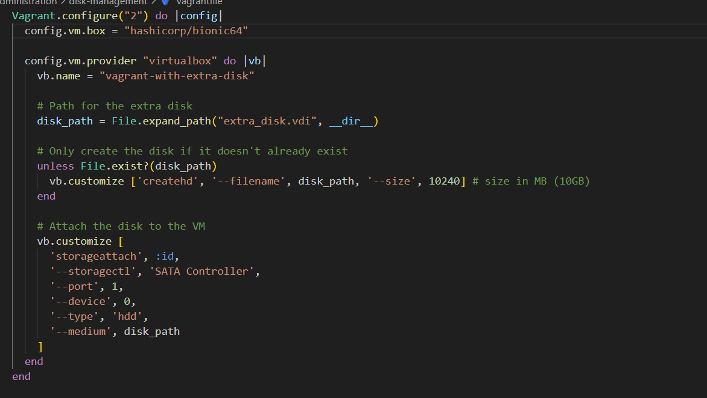
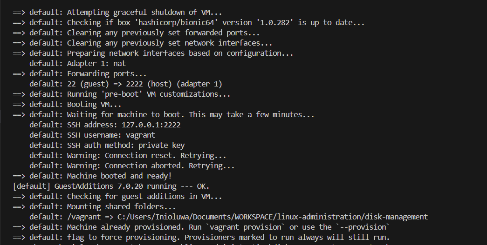
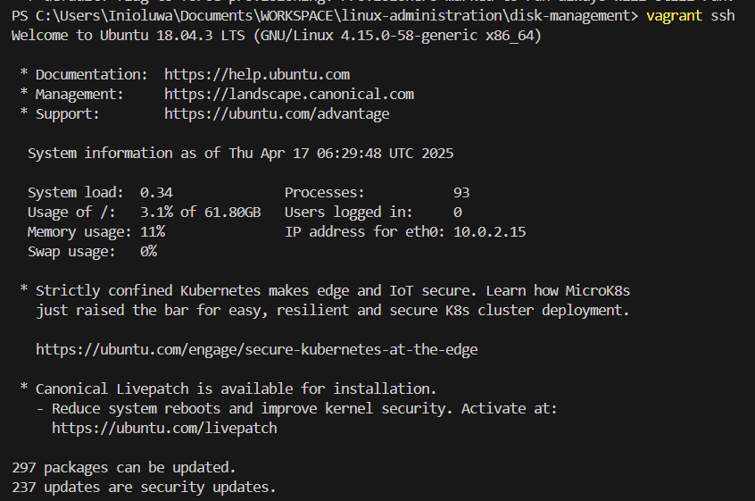
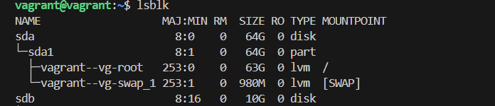

### Creating new partition
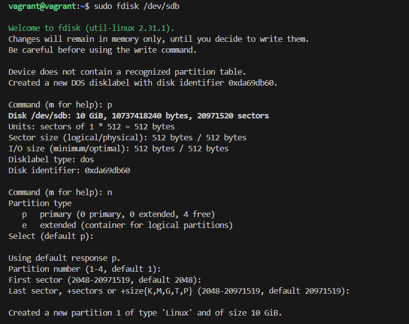
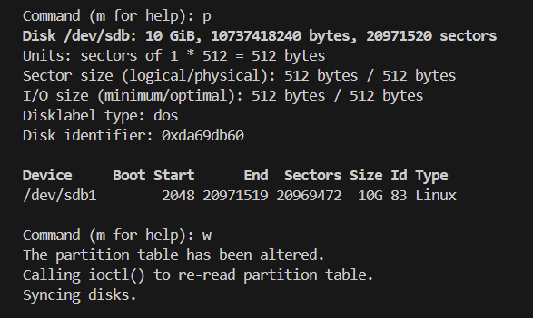

### Formatting partition
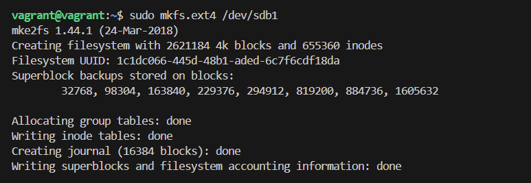

### Mounting partition
 
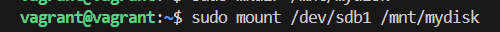

### Verifying mount
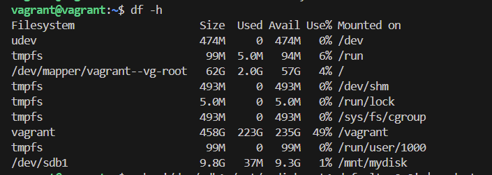

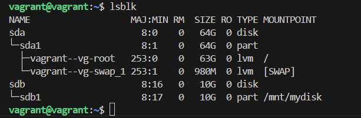
### Adding to /etc/fstab
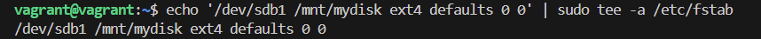

