## Entering ssh environment
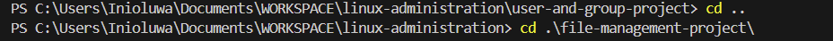
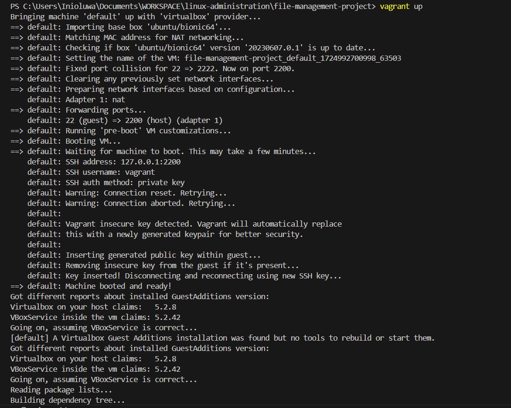
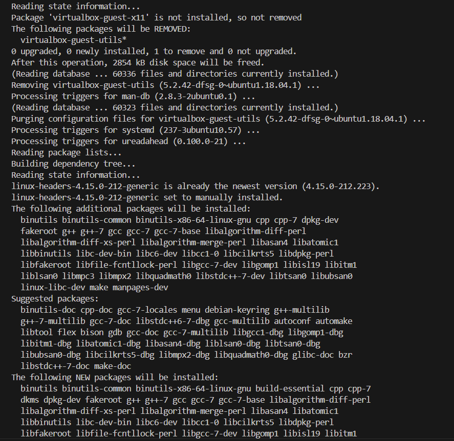
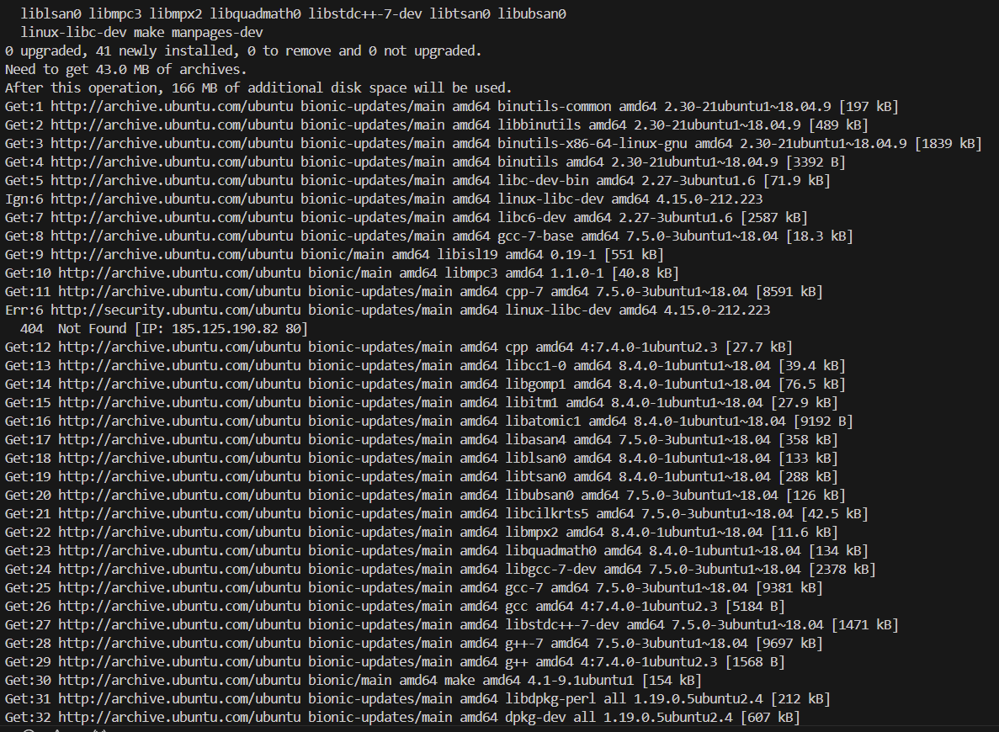
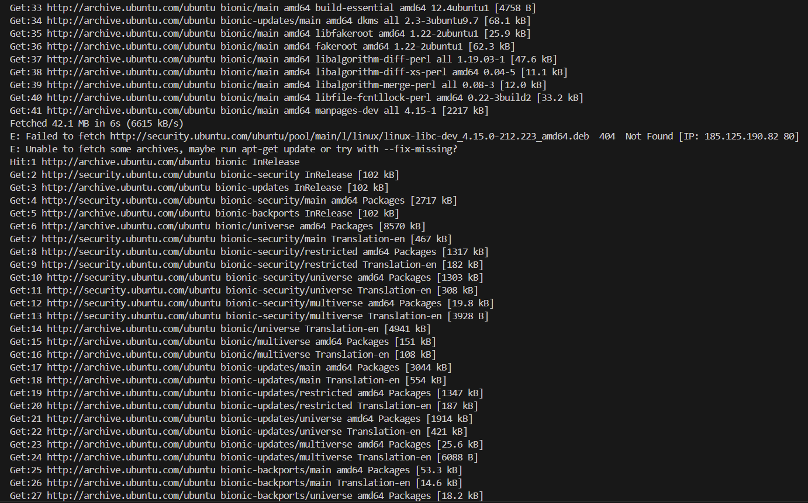
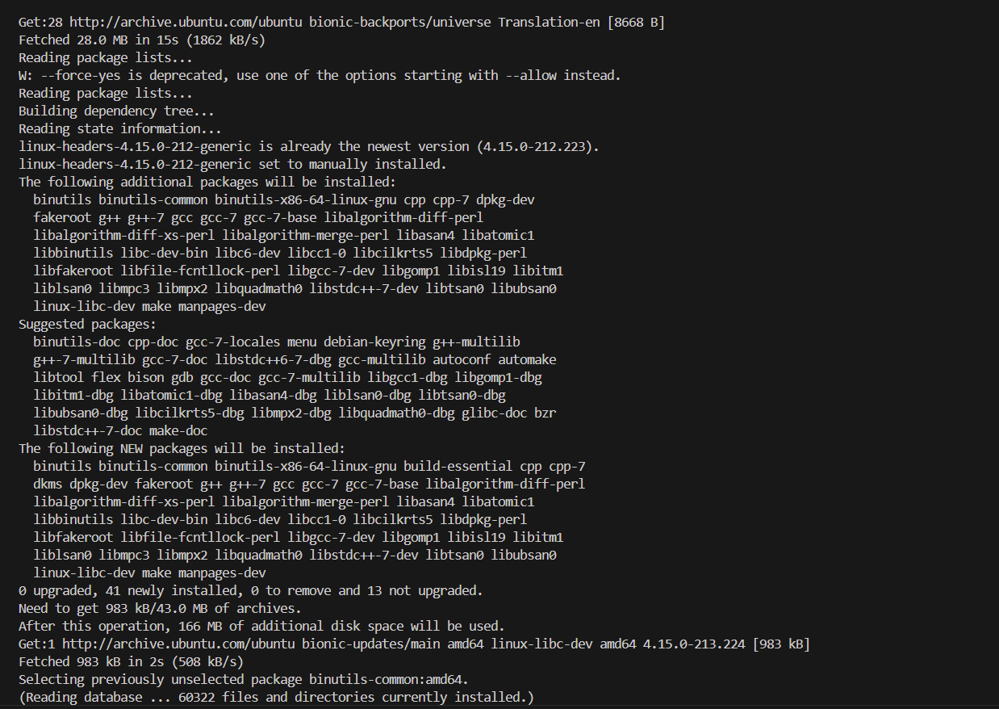
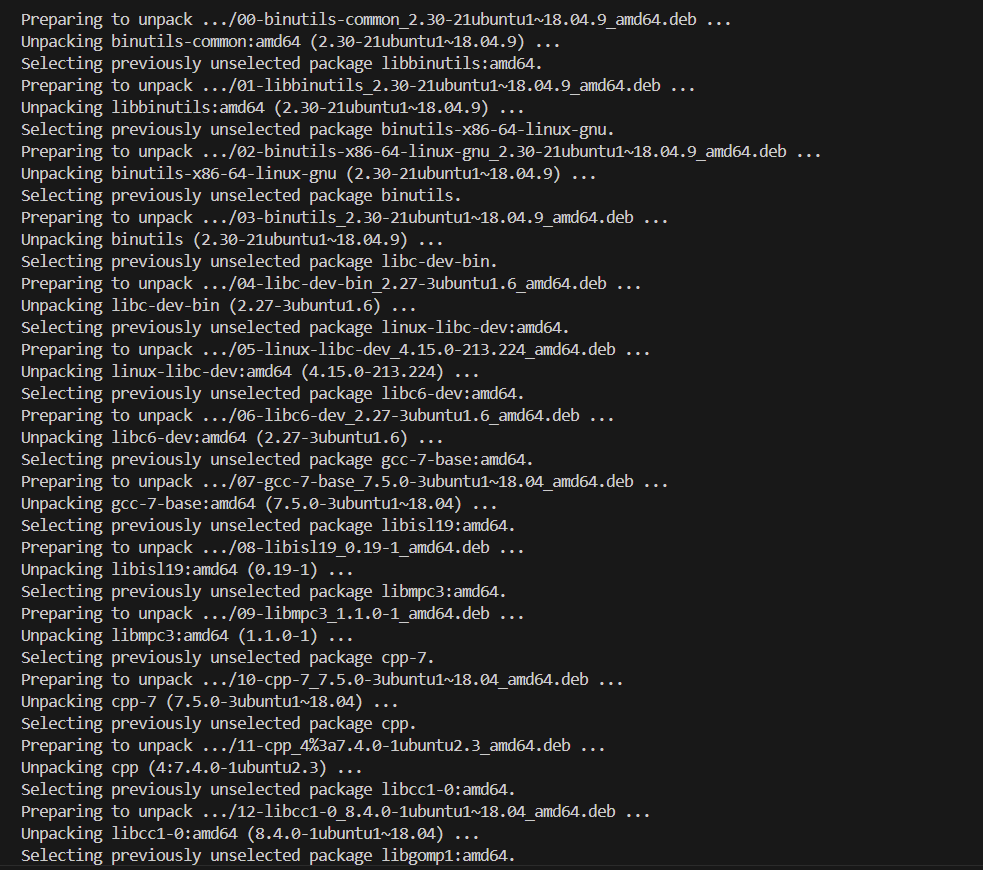
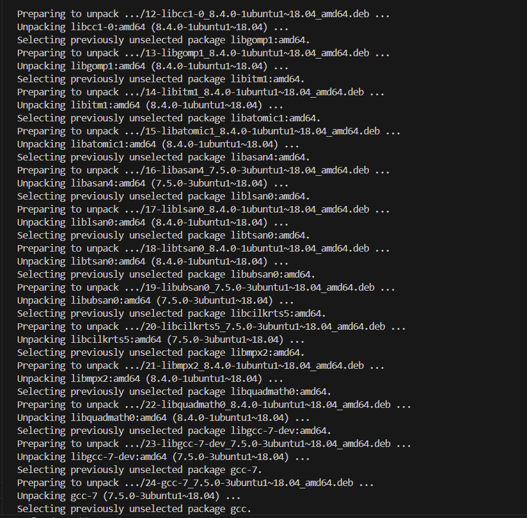
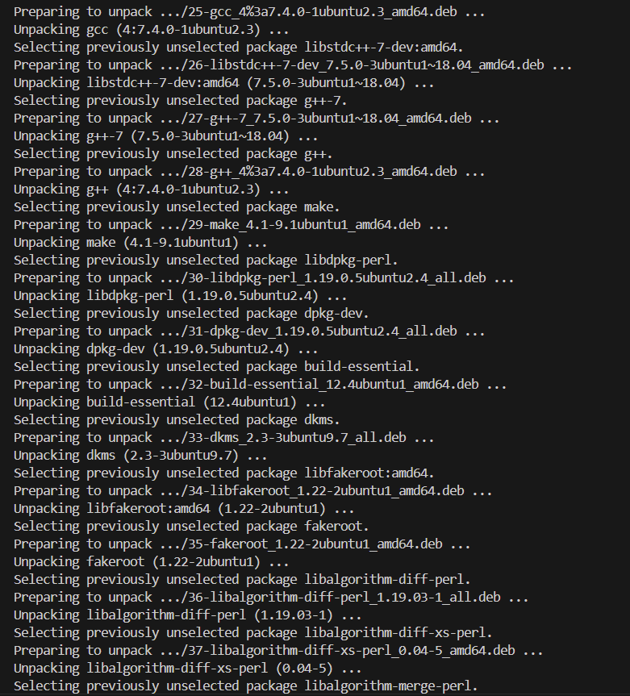
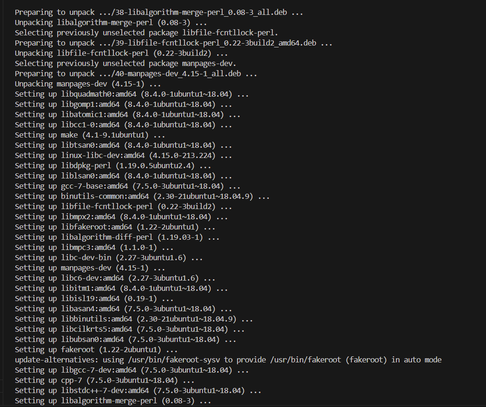
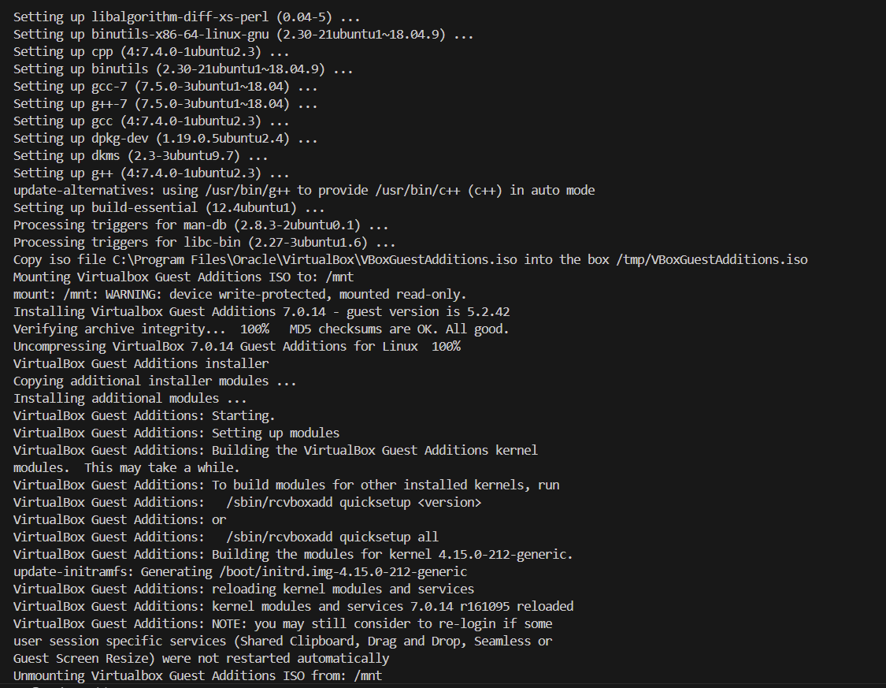
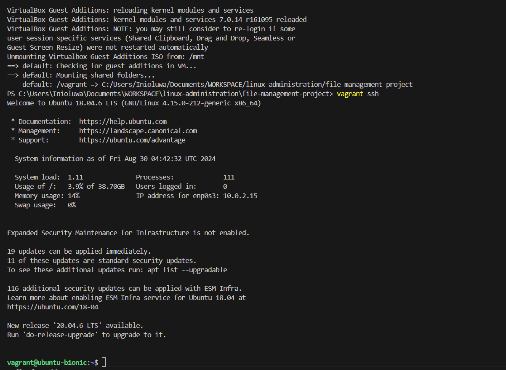

## Creating and entering a new directory 
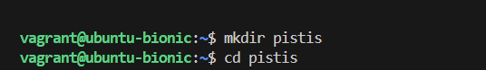

## Creating new file and directoey
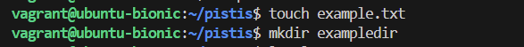

## listing files
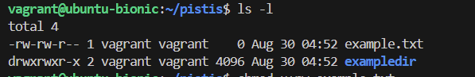

## Modifying file permission

## Modifying directory permission

## Creating new group
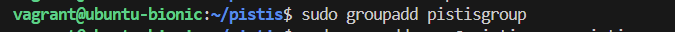

## Creating new user

## Changing file ownwership

## Changing directory ownership
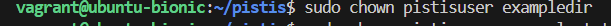

## Changing group ownership

## Verifying Permissions and Ownership

## Testing access
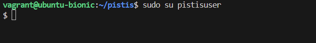

