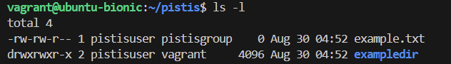

## Entering ssh environment

## Creating and entering a new directory 

## Creating new file and directoey

## listing files

## Modifying file permission

## Modifying directory permission

## Creating new group

## Creating new user

## Changing file ownwership

## Changing directory ownership

## Changing group ownership

## Verifying Permissions and Ownership

## Testing access

