## Entering my ssh environment
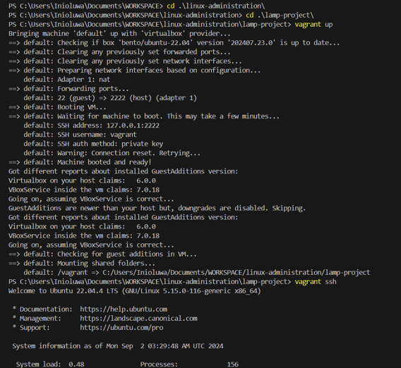

## Installing Apache2 and Updating the Firewall
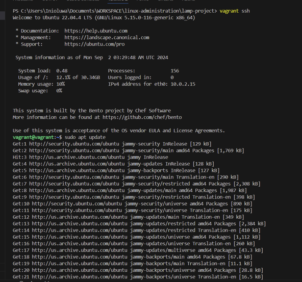
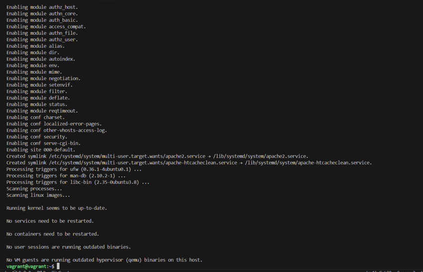
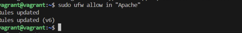

##  Installing MySQL
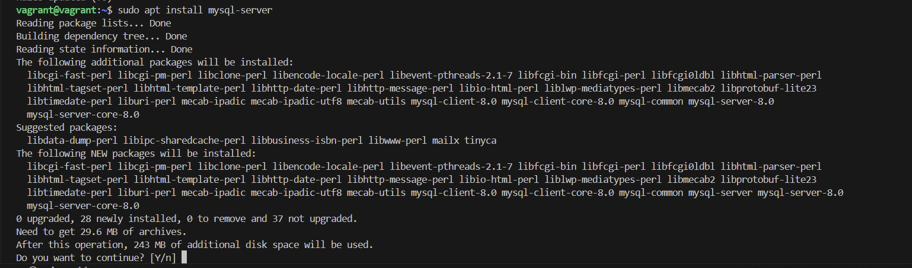
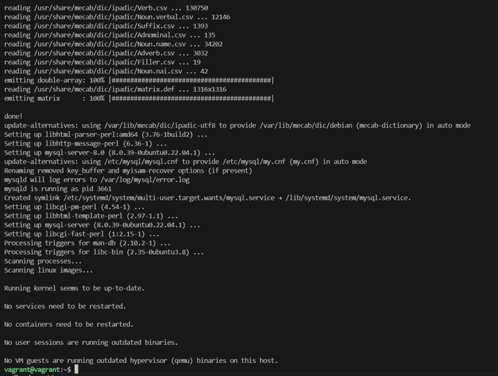
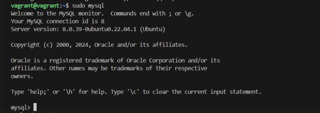
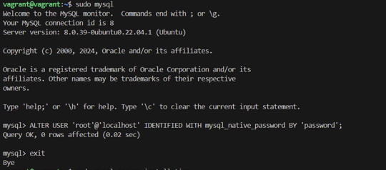

### Running MySQL security script
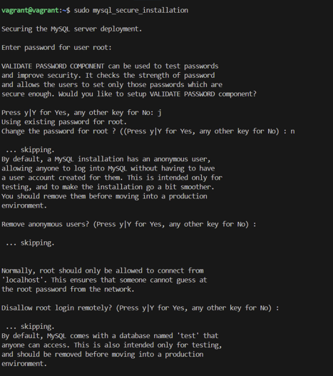
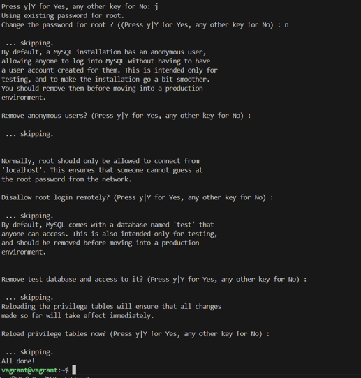

## Installing PHP
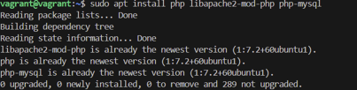

## Creating a Virtual Host for my Website
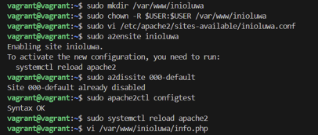

### configuration file
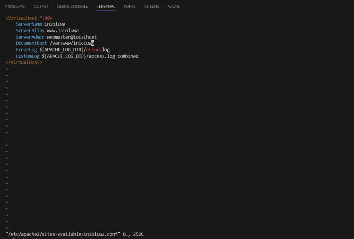
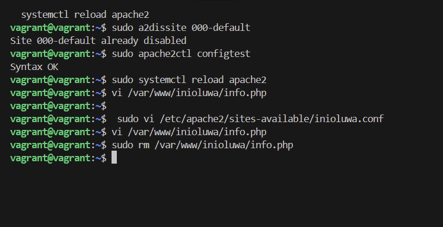

##  Testing PHP Processing on my Web Server
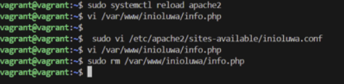

### PHP file
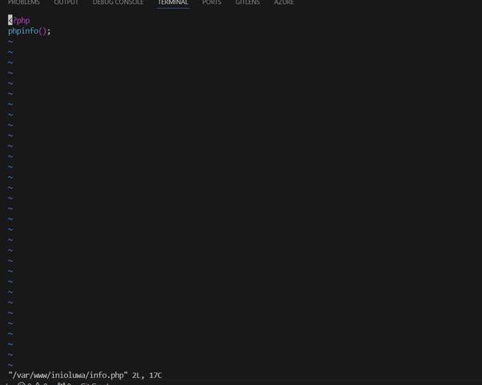

### PHP page 
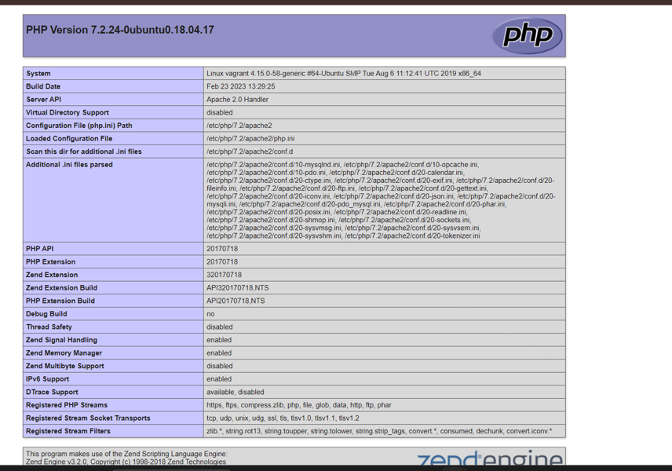

### Removing PHP file
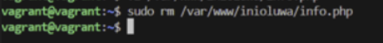

##  Testing Database Connection from PHP 
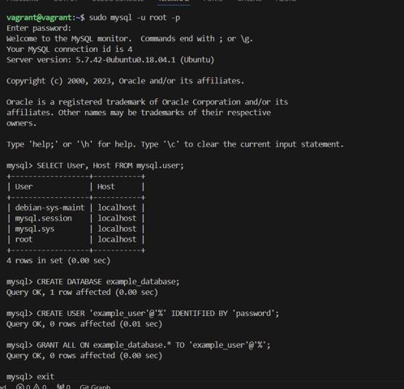

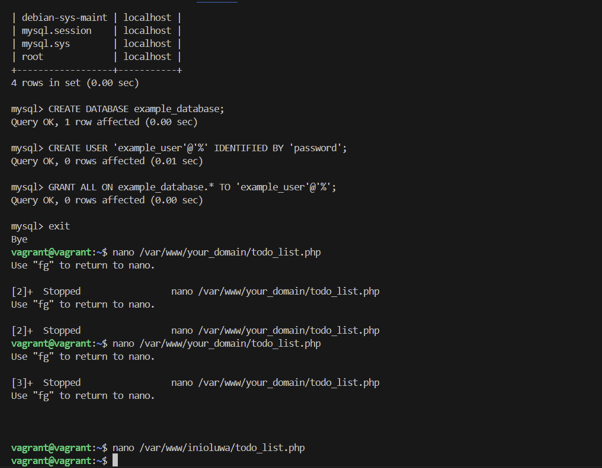

### PHP Todolist file
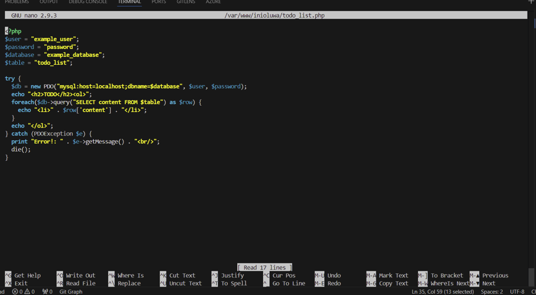

### PHP page
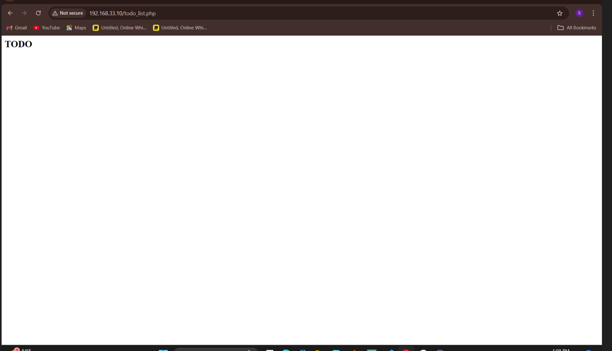

