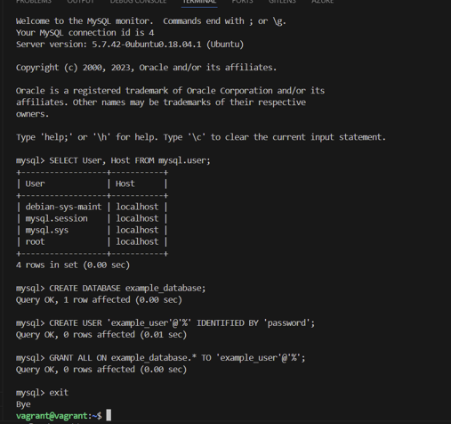

## Entering my ssh environment

## Installing Apache2 and Updating the Firewall

##  Installing MySQL

### Running MySQL security script

## Installing PHP

## Creating a Virtual Host for my Website

### configuration file

##  Testing PHP Processing on my Web Server

### PHP file

### PHP page 

### Removing PHP file

##  Testing Database Connection from PHP 

### PHP Todolist file

### PHP page

