## Entering my ssh environment
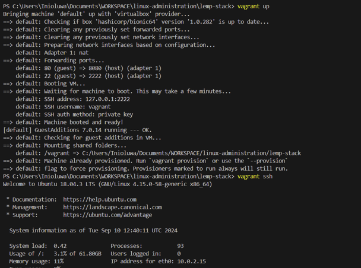

## Installing the Nginx Web Server
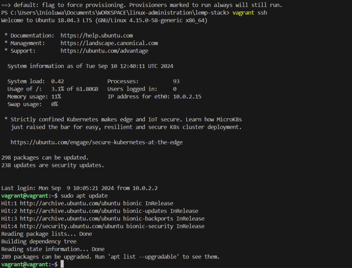
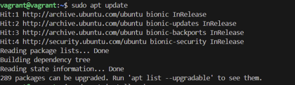
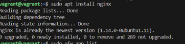
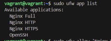
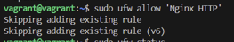
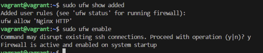
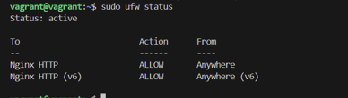
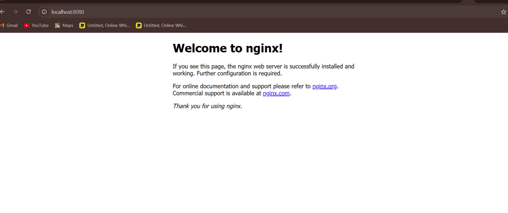

## Installing MySQL
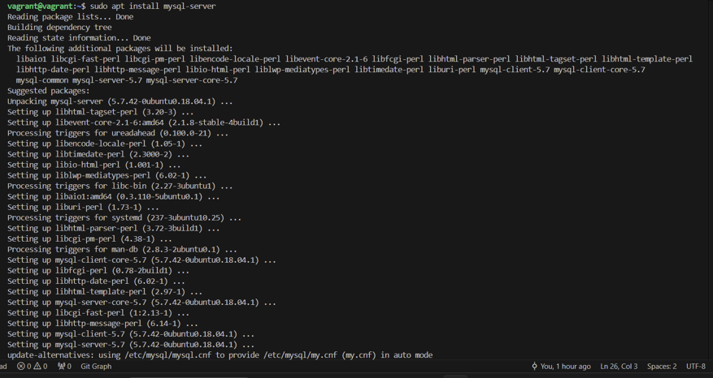
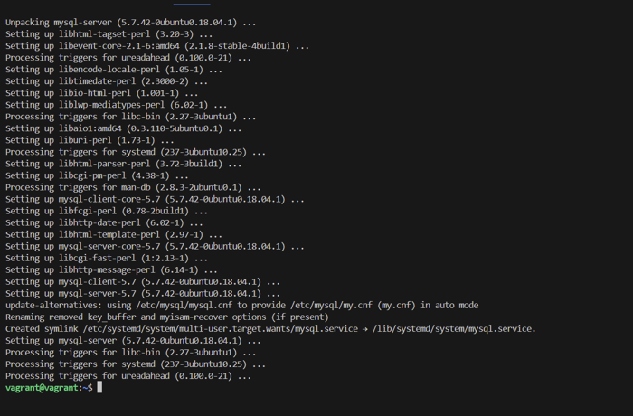
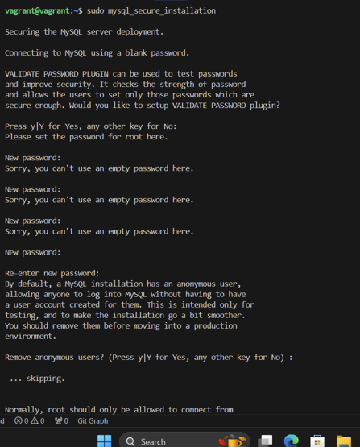
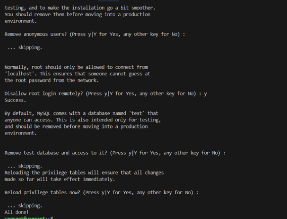
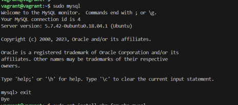

##  Installing PHP
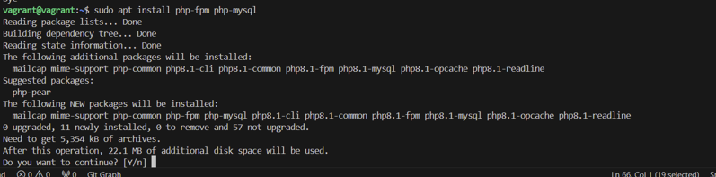

## Configuring Nginx to Use the PHP Processor
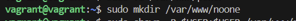

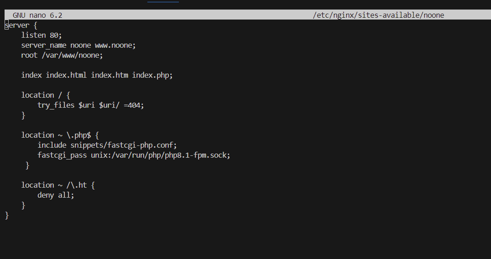
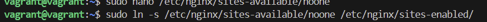
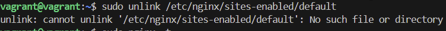
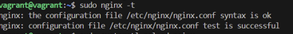

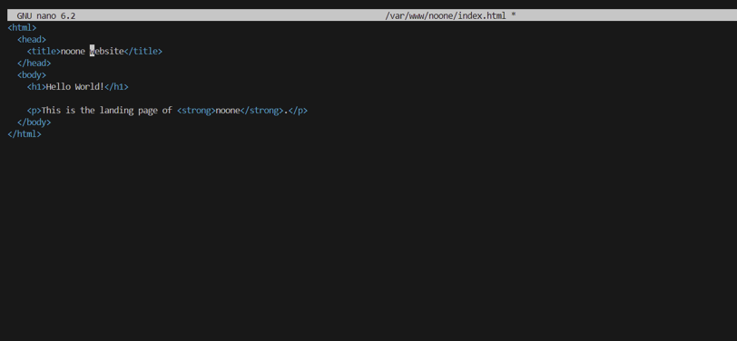

##  Testing PHP with Nginx

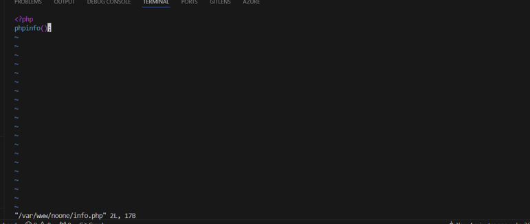
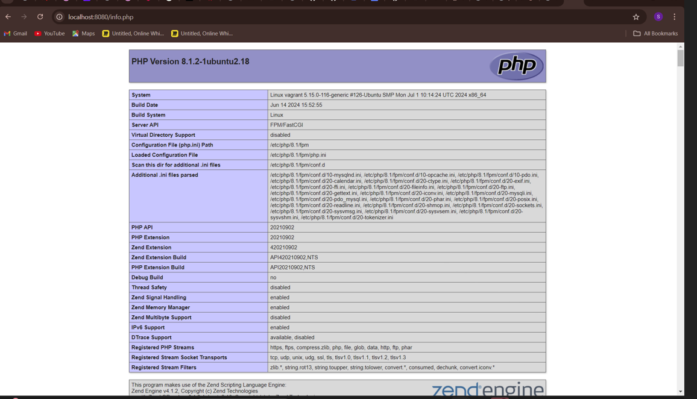

##  Testing Database Connection from PHP 
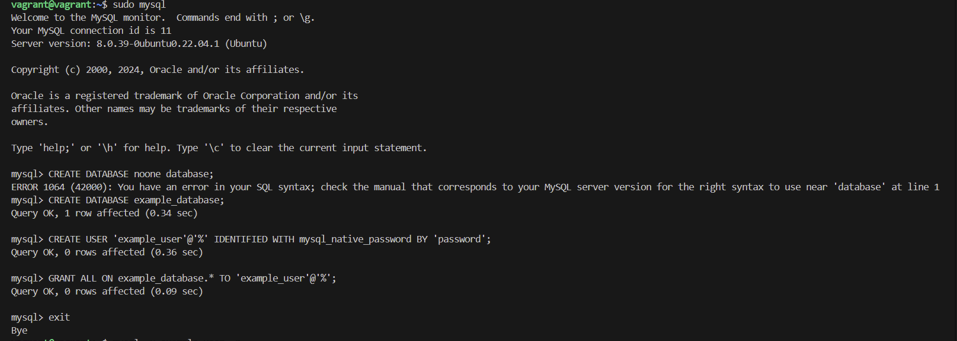
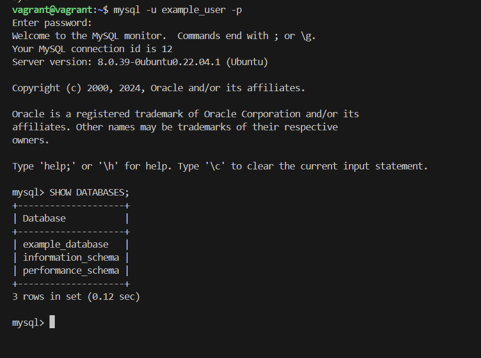
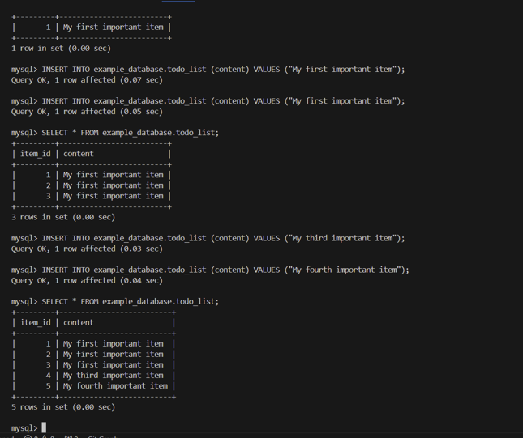
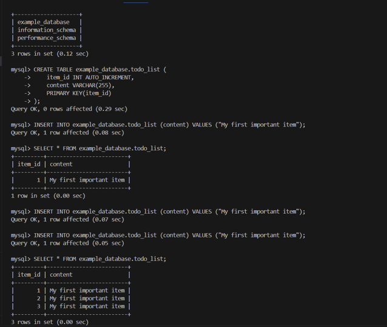

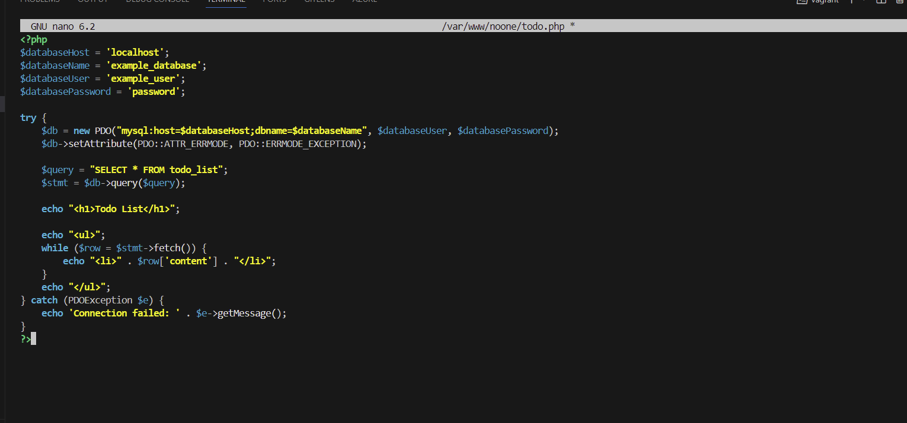

