## Task 1: Choosing an OS for DevOps Automation

### Choosing an OS for DevOps Automation: A Comparison of Linux and Windows

DevOps automation focuses on improving the efficiency, speed, and reliability of software delivery through tools and practices that automate repetitive tasks. A key aspect of DevOps is the environment in which automation happens, and the choice between **Linux** and **Windows** plays a significant role in how well these tasks can be automated. Below is a comparison of Linux and Windows based on three key factors: **scripting abilities**, **package management**, and **container compatibility**.

---

### 1. **Scripting Abilities**
   **Linux**:  
   Linux has a long history of providing powerful scripting tools that are essential for DevOps automation. The **Bash shell** is the default scripting language and is extremely versatile, allowing for complex tasks such as file manipulation, process management, and automation of system operations. Bash scripts are widely used for automating setup, deployment, monitoring, and system maintenance. Additionally, Linux provides a wide range of scripting languages like **Python**, **Perl**, and **Ruby**, which are used extensively in the DevOps world for automation tasks.

   **Windows**:  
   Windows primarily relies on **PowerShell** for automation, which is a powerful scripting language designed for system administration. PowerShell is robust and object-oriented, making it suitable for automating a wide range of tasks. However, while PowerShell is powerful, it is not as universally adopted in DevOps as Bash. Windows also supports scripting through **Batch** files and other languages like **Python**, but PowerShell is typically favored for DevOps automation in Windows environments.

---

### 2. **Package Management**
   **Linux**:  
   Linux package management systems are highly efficient and streamlined, making it easier to install, update, and remove software in an automated fashion. **APT** (Advanced Packaging Tool) for Debian-based systems (e.g., Ubuntu) and **YUM/DNF** for Red Hat-based systems (e.g., CentOS, Fedora) are the most common package managers. These package managers handle dependencies, making automation of software updates and installation seamless. Additionally, Linux package managers integrate easily with configuration management tools like **Ansible**, **Puppet**, and **Chef**, which are heavily used in DevOps workflows.

   **Windows**:  
   Windows offers package management tools such as **Windows Package Manager (winget)** and **Chocolatey**. While these tools have improved over the years, package management on Windows is generally not as seamless as on Linux. The Windows ecosystem traditionally relies more on graphical installers, which can complicate automated deployments. However, tools like **Chocolatey** offer a package management system that is somewhat comparable to Linux’s package managers, though it doesn’t have the same level of integration with popular automation tools as Linux.
---

### 3. **Container Compatibility**
   **Linux**:  
   Linux is the dominant operating system for containers, largely due to the native support for **Docker** and **Kubernetes**. Containers rely on kernel features like cgroups and namespaces, which are naturally supported by Linux. Docker containers are optimized for Linux environments, and the majority of the containerized applications in the DevOps ecosystem run on Linux. Tools like Kubernetes, which automate the deployment, scaling, and management of containerized applications, are most commonly deployed on Linux.

   **Windows**:  
   Windows has introduced support for containers, but it has limitations compared to Linux. While **Docker for Windows** allows running containers, Windows containers are not as widely used, and their compatibility is limited to certain types of applications. Furthermore, Windows containers do not provide the same level of ecosystem support as their Linux counterparts. Although Kubernetes can run on Windows, the vast majority of Kubernetes clusters and containerized workloads are deployed on Linux.

---

### Conclusion: Which OS is Better for DevOps Automation?

When evaluating Linux and Windows for DevOps automation, **Linux** consistently emerges as the superior choice. Linux provides extensive support for scripting, robust package management systems, and seamless compatibility with containers, all of which are fundamental for automating DevOps workflows. The open-source nature of Linux also encourages a rich ecosystem of tools and support from the DevOps community, making it the de facto standard for most DevOps tasks.

Windows, while improving in areas like scripting and containerization, still faces limitations in DevOps automation, especially with containerization and package management. PowerShell, although powerful, is not as widely adopted as Bash, and Windows containers are not as universally supported or optimized as Linux containers.

Therefore, for most DevOps teams focused on automation, **Linux** is the better platform for managing and automating the entire software lifecycle.

## Task 2: Configuring the OS with Bash Scripts

<!-- - Creating a Bash script to:

Update OS packages

Install essential tools (if necessary)

Enable firewall -->

 Creating a bash script , I have to do a vagrant ssh
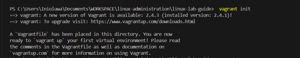
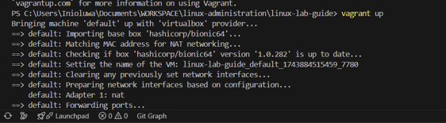
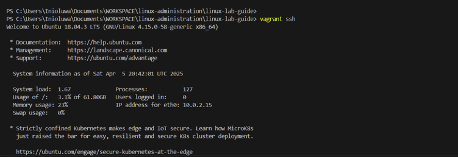

### Creating bash script

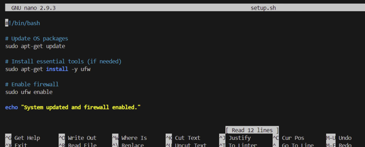

### Making it executable & running it

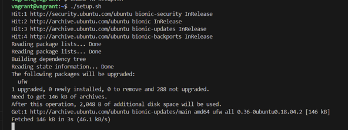
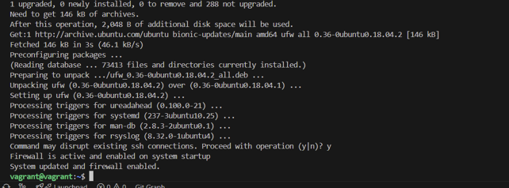

### Scheduling the script to run daily using cron:
<!-- 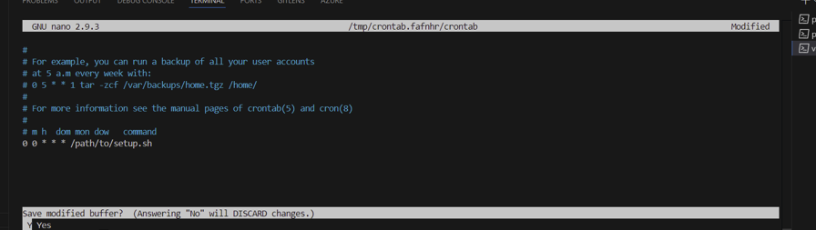 -->
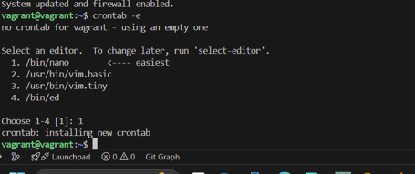

### Adding the following line to run it at midnight:
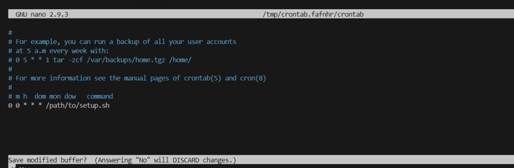

## Task 3: System Monitoring and Logging

### Installing htop for real-time monitoring:
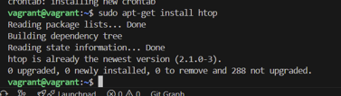

### Create a script for logging system metrics:

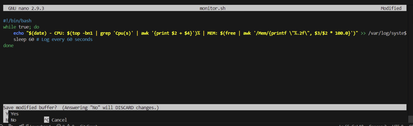

### making it executable and run it in the background:

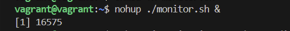

### View the logs with:
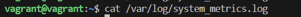
