## Setting a Static IP Address:

### Editing the network configuration file to set a static IP address.
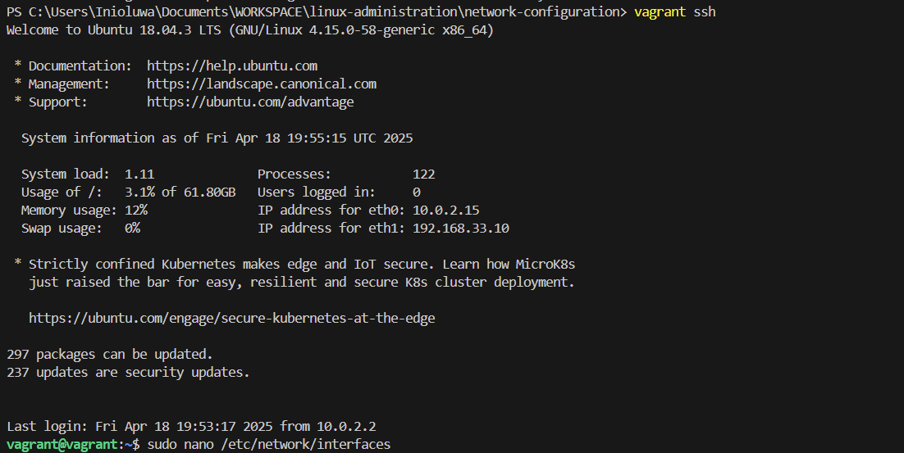

### Adding the following lines (adjust for your network):
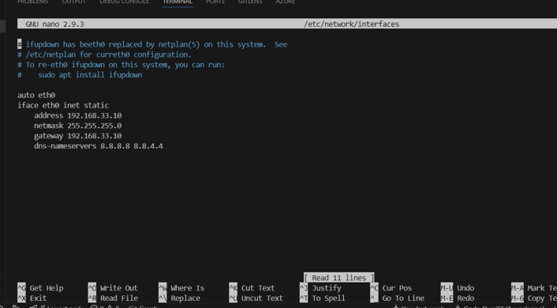

### Restarting the networking service.
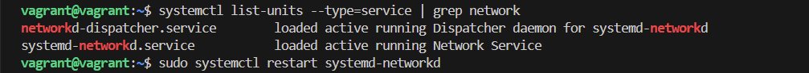
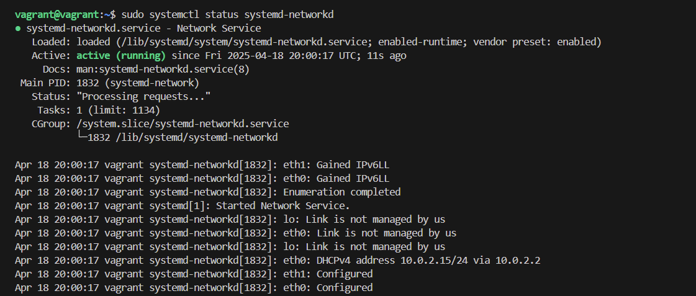

## Testing Network Connectivity:
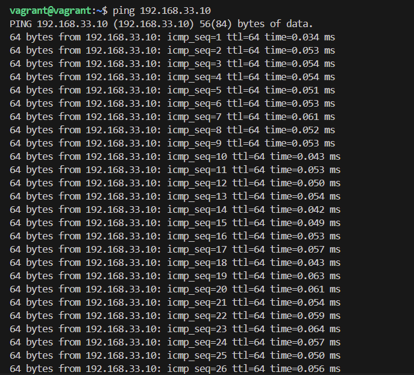
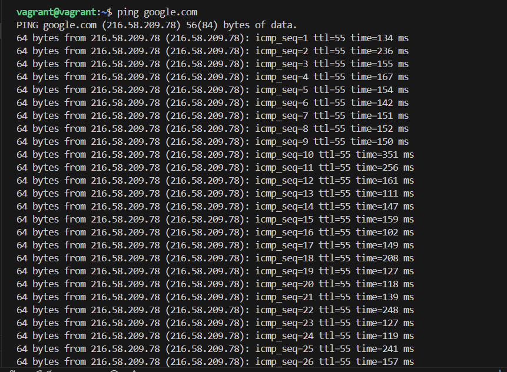

## Capturing Network Traffic:
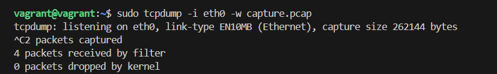
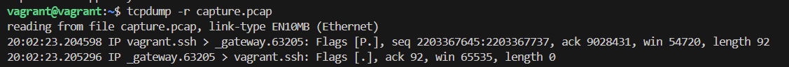

## Setting Up a Firewall:
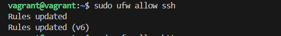
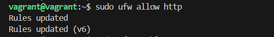
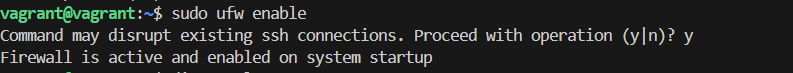

## Troubleshooting DNS:
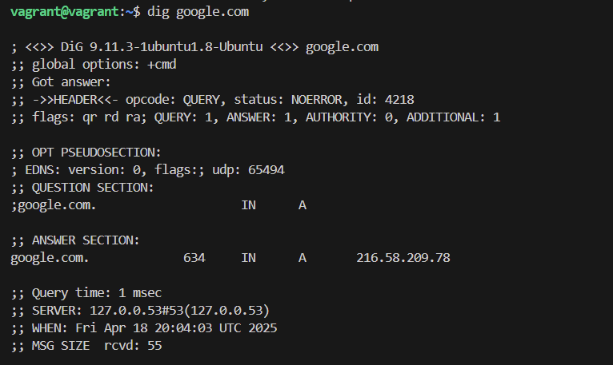

