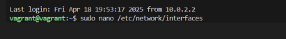
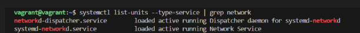
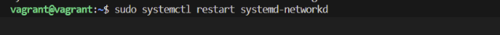

# Project Title: Network Configuration and Troubleshooting

## Objective: Learning how to configure and troubleshoot network settings in Linux.

## The following steps are as follows :

## 1. Setting a Static IP Address:

### Editing the network configuration file to set a static IP address.

### Adding the following lines (adjusting for my network):

### Restarting the networking service.

#### To restart my network service, I firstlt checked the network my system is using

#### Finally restarted it 

#### Checked its status

## 2. Testing Network Connectivity:

## 3. Capturing Network Traffic:

## 4. Setting Up a Firewall:

## 5. Troubleshooting DNS:

