## Entering ssh environment
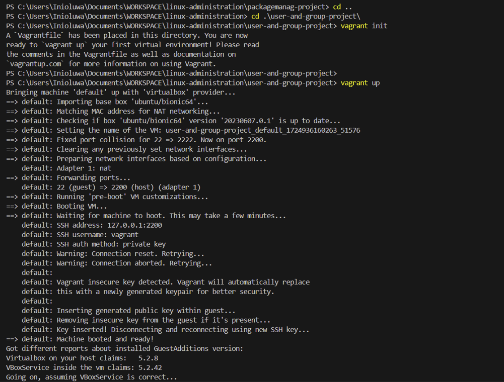
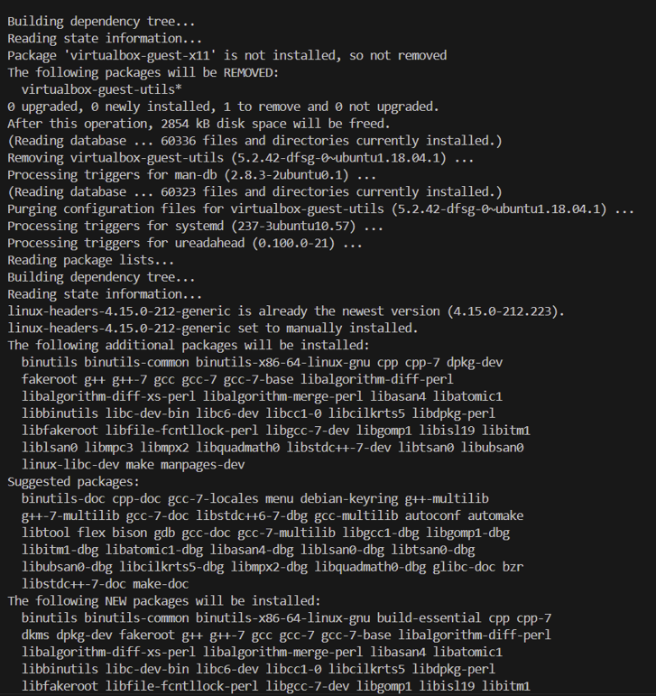

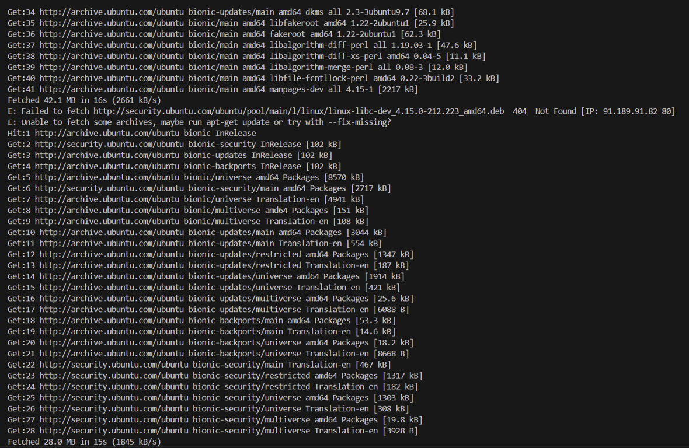
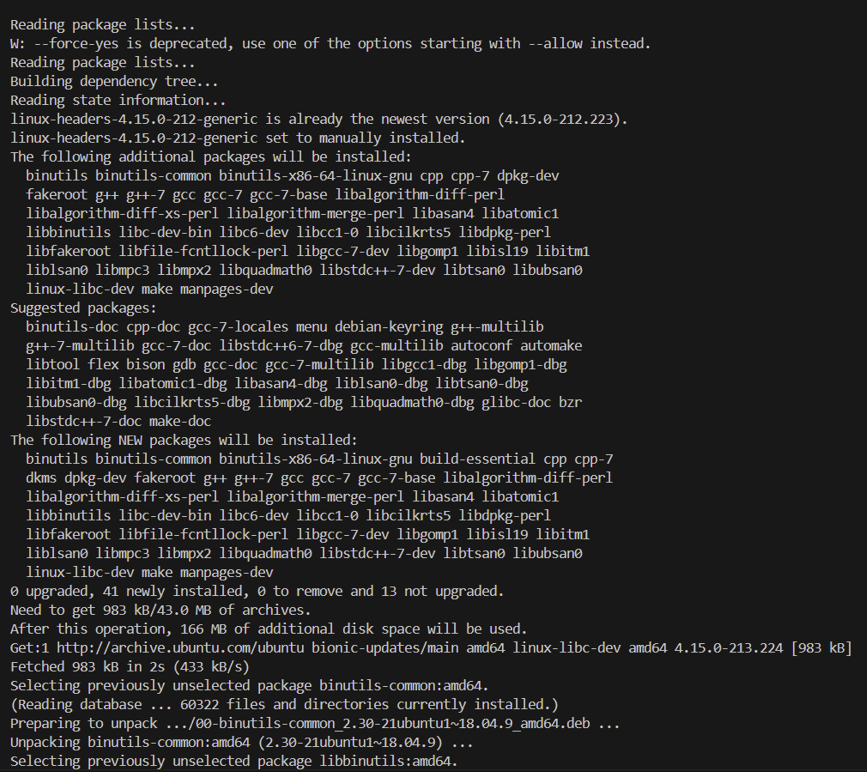
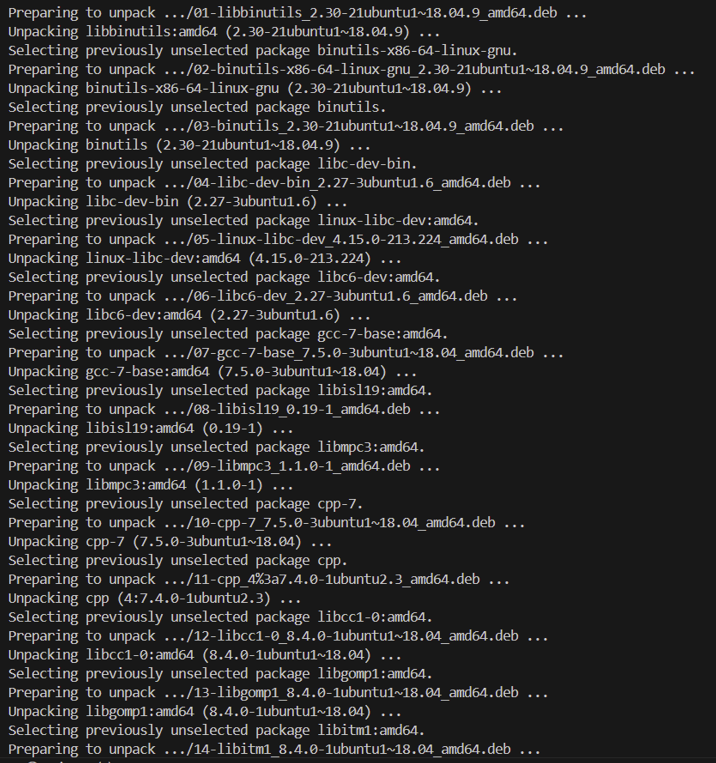
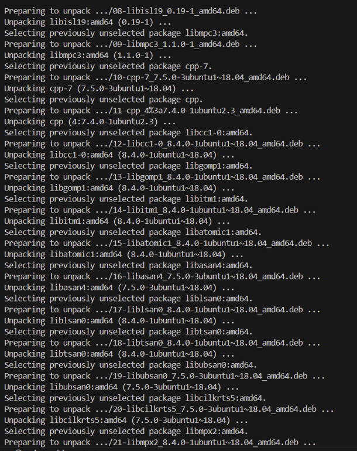
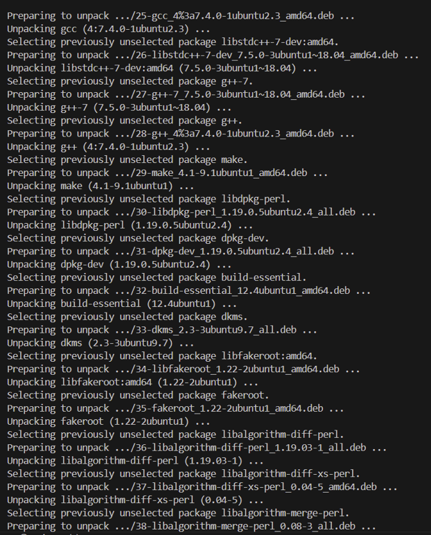
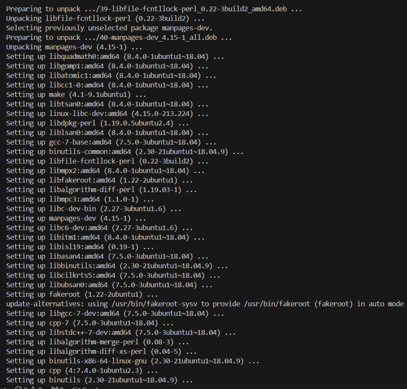
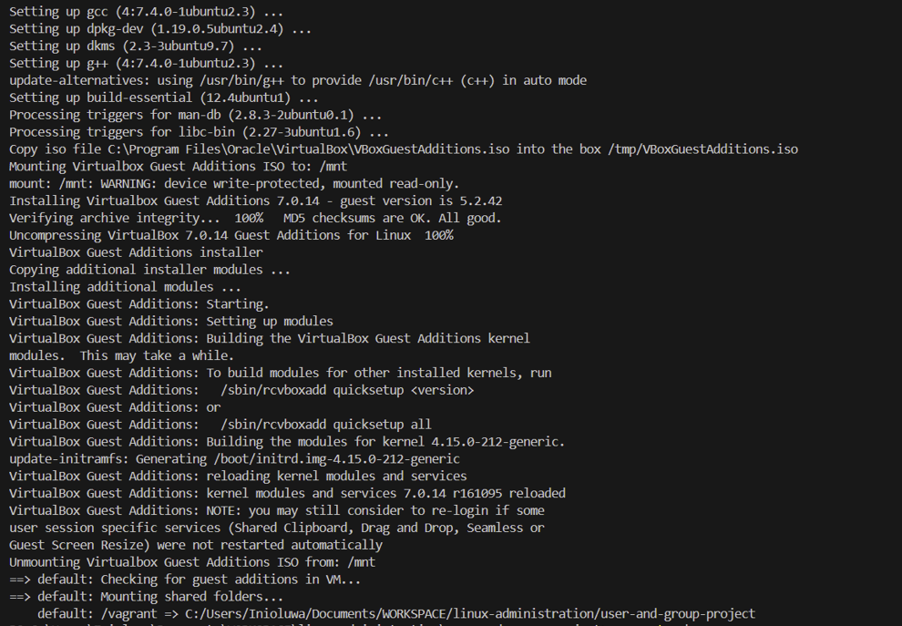
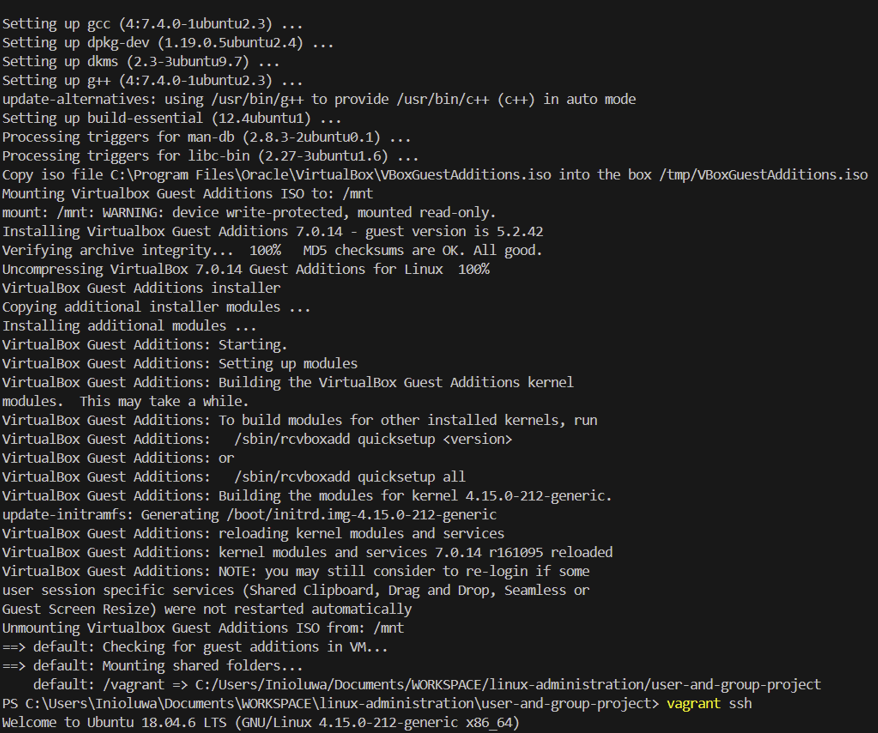

## creating a new user

## Setting password for the newuser
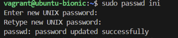

## Creating a newgroup

## Adding user to group

## Verifying user and group creation

## Modifying User and Group Information

## Deleting User

## Deleting Group

